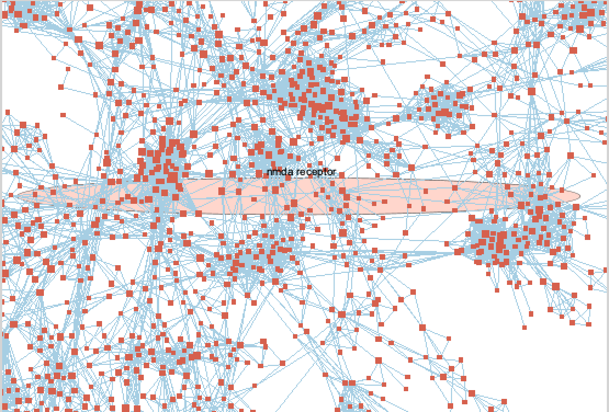

Quick links (more details at introduction):

Assignment used the base docker image [acessible here](https://hub.docker.com/repository/docker/risserlin/em_base_image).

Chosen study: [Serotonin-induced hyperactivity in SSRI-resistant major depressive disorder patient-derived neurons](https://pubmed.ncbi.nlm.nih.gov/30700803/)[@vadodaria2019serotonin].

GEO data set: [GEO accession GSE125664](https://www.ncbi.nlm.nih.gov/geo/query/acc.cgi?acc=GSE125664)[@vadorariaGEO]

# 1. Introduction: A1 and A2 summary

## 1.1 Selection of an expression data set and software tools

Previously, in A1, we have found an appropriate study (in terms of RNA expression analysis and clinical relevance) by searching RNAseq data set available at [Gene Expression Omnibus repository - GEO] (www.ncbi.nlm.nih.gov/geo)[@GEO].

We used Geometadb[@Geometadb] to perform the search of GEO data sets and RSQLite[@RSQLite] and GEOquerry[@GEOquery] package to perform the queries using a downloaded copy of GEO contents' metadata. These packages were installed, when needed through BiocManager[@BiocManager] functionality. knitr[@knitr] package was later used to report data statistics and edgeR to aid on modeling and normalization of data.

```{r, echo = FALSE, message = FALSE}
if (!requireNamespace("BiocManager", quietly = TRUE))
  install.packages("BiocManager")

if (!requireNamespace("GEOmetadb", quietly = TRUE))
  BiocManager::install("GEOmetadb")

if (!requireNamespace("RSQLite", quietly = TRUE))
  BiocManager::install("RSQLite")

if (!requireNamespace("GEOquery", quietly = TRUE))
  BiocManager::install("GEOquery")

if (!requireNamespace("knitr", quietly = TRUE))
  BiocManager::install("knitr")

if (!requireNamespace("edgeR", quietly = TRUE))
  BiocManager::install("edgeR")

if (!requireNamespace("ComplexHeatmap", quietly = TRUE))
  BiocManager::install("ComplexHeatmap")

if (!requireNamespace("circlize", quietly = TRUE))
  BiocManager::install("circlize")

if(!file.exists('GEOmetadb.sqlite')) 
  GEOmetadb::getSQLiteFile()

library(BiocManager)
library(GEOmetadb)
library(RSQLite)
library(GEOquery)
library(knitr)
library(edgeR)
library(ComplexHeatmap)
library(circlize)
```

```{r, eval = FALSE, echo = FALSE, message = FALSE}
con <- dbConnect(SQLite(),'GEOmetadb.sqlite')

sql <- paste("SELECT DISTINCT gse.title,gse.gse, gpl.title,",
            " gse.submission_date,",
            " gse.supplementary_file",
            "FROM",
            " gse JOIN gse_gpl ON gse_gpl.gse=gse.gse",
            " JOIN gpl ON gse_gpl.gpl=gpl.gpl",
            "WHERE",
            " gse.submission_date > '2011-02-01' AND",
            " gse.title LIKE '%depressive%' AND",
            " gpl.organism LIKE '%Homo sapiens%' AND",
            " gpl.technology LIKE '%high-throughput sequencing%' ",
            " ORDER BY gse.submission_date DESC",sep=" ")

rs <- dbGetQuery(con,sql)
dim(rs)
dbDisconnect(con)
```

After 4 search iterations we have chosen the following study: [Serotonin-induced hyperactivity in SSRI-resistant major depressive disorder patient-derived neurons] (https://pubmed.ncbi.nlm.nih.gov/30700803/)[@vadodaria2019serotonin] in which the authors tried to elucidate the common clinical challenge of patients suffering from Major Depressive Disorder (MDD) who fail or respond only partially to SSRI therapy (aka non-remitters). We currently have no biomarkers to identify these patients. Moreover, is not known the specific mechanism underpinning SSRI and similar SNRI-induced suicidality.

It also provided the raw mRNA counts for analysis. The controls are represented by expression data in forebrain neuron lines developed from Induced pluripotent stem cells (iPSCs) removed through non-CNS biopsy of healthy patients exposed to SSRIs. The test group involve the same cells from MDD patients which suffered from SSRI treatment resistance and MDD patients which responded to SSRI treatment.

The sample size in this study is 9, with adequate control and 2 testing groups (MDD with an without SSRI-based treatment resistance). 


## 1.2. Downloading the data, cleaning and compute summary statistics

The data for this study is contained in one supplemental .csv file called "GSE125664_Vadodaria_MDDNeurons_RawCounts":

```{r, echo=FALSE, message = FALSE}
if(!file.exists('SSRI_exp_file')) {
    sfiles = getGEOSuppFiles('GSE125664')
    fnames = rownames(sfiles)
    # Just one file, but we have a .csv here
    SSRI_exp = read.csv(fnames[1],header=TRUE, check.names = FALSE)
    # Naming its gene name column as gname
    names(SSRI_exp)[1] <- "gname"
    saveRDS(SSRI_exp, file = "SSRI_exp_file.rds")
}

if(!exists("SSRI_exp")){
    SSRI_exp <- readRDS(file = "SSRI_exp_file.rds")
}

# Capturing its description, inspired on lecture 4
SSRI_gse <- getGEO("GSE125664",GSEMatrix=FALSE)
SSRI_gpl <- names(GPLList(SSRI_gse))[1]
SSRI_gpl_info <- Meta(getGEO(SSRI_gpl))
```

__Platform title:__ `r SSRI_gpl_info$title`

__Submission date:__ `r SSRI_gpl_info$submission_date`

__Last update date:__ `r SSRI_gpl_info$last_update_date`

__Organisms:__  `r SSRI_gpl_info$organism`

Snapshot of data first 10 mapped genes at this stage:

```{r, fig.width= 3, fig.height= 3}
kable(SSRI_exp[1:10,1:10], format = "html")
```

```{r}
dim(SSRI_exp)
```

And we have 22351 genes with measures for 3 controls, 3 non-resistant-to-SSRI MDD patients and 3 resistant-to-SSRI MDD patients.

Counts for each gene show each gene with the frequency of exactly one, except for some miscoded names.

```{r eval = FALSE, echo = FALSE}
gene_counts <- sort(table(SSRI_exp$gname), decreasing = TRUE)
```

28 genes contained miscoded names (they expressed dates instead of valid identifiers) and we will have to remove them. 

```{r echo = FALSE}
SSRI_exp_clean <- SSRI_exp[ !(SSRI_exp$gname %in% c("1-Mar", "1-Mar", "2-Mar", "2-Mar", "1-Dec", "1-Sep", "10-Mar", "10-Sep", "11-Mar", "11-Sep", "12-Sep", "14-Sep", "15-Sep", "2-Sep", "3-Mar", "3-Sep", "4-Mar", "4-Sep", "5-Mar", "5-Sep", "6-Mar", "6-Sep", "7-Mar", "7-Sep", "8-Mar", "8-Sep", "9-Mar", "9-Sep")), ]
```

Each mRNA reading was already mapped to unique genes expressed as HUGO Gene Nomenclature Committee symbols) so we proceeded to calculate counts per million reads mapped (cmp). All the counts with less than 9 counts where removed and that removed 9350 gene observations. There after that, and after the cleaning the data, there were no duplicates and all the symbols where unique symbols that complied with HUGO Gene Nomenclature Committee. After all removals and manipulations, the dataset coverage was 0.59.

```{r echo = FALSE}
cpms = cpm(SSRI_exp_clean[,2:10])
rownames(cpms) <- SSRI_exp_clean[,1]
# Our study contains 9 samples
keep = rowSums(cpms >1) >=9
SSRI_exp_filtered = SSRI_exp_clean[keep,]
```

We have kept 12973 gene counts, meaning we had to filter out `r 1-(dim(SSRI_exp_filtered)[1]/dim(SSRI_exp_clean)[1])` of our gene-mapped RNA seq observations

## 1.3. Normalization

We used TMM (Trimmed Mean of M-values) normalization. For most samples the distribution curve pre and post-normalization is very similar, however there is a noticiable change towards the mean (a bit higher than 5) for the second control (H_neuron_2) and, interestingly, for 2 of the 3 nonremitter patients.

```{R, fig.width=5, fig.height=5}

data2plot <- log2(cpm(SSRI_exp_filtered[,2:10]))

SSRI_matrix <- as.matrix(SSRI_exp_filtered[,-1])

rownames(SSRI_matrix) <- SSRI_exp_filtered$gname

# inspired by Yi Fei Huang approach in terms of merging samples into groups

categories <- c("healthy", "healthy", "healthy",
             "nonremitter", "nonremitter", "nonremitter",
             "remitter", "remitter", "remitter")

# inspired by lecture 4 slides 51 and 52

d = DGEList(counts=SSRI_matrix, group=categories)

# Calculation of normalization factors

d = calcNormFactors(d)

normalized_counts <- cpm(d)
    
```


## 1.4. Differential Gene Expression analysis

Here, we test for statistically significant expression differences for each of the mapped genes, between our 3 groups (we will call it status) of interest in our designed model: healthy patients exposed to SSRI (control), non-remitters MDD exposed to SSRI (test 2) and remitter MDD exposed to SSRI (test 2). 

An expansion of this model includes 2 groups (we will call this attribute "affected"), healthy (ND) and affected by disease (D), although this expansion wouldn't add granularity to the assessment of different subtypes of MDD (refractive or not to treatment), it could help in increasing specificity to the bayes differential expression significance calculation.

We used 2 distinct but symmetrical models that will assess remitters MDD patient's cells VS Healthy control cells and remitters MDD patient's cells VS non-remitters MDD patient's cells separately.

samples <- data.frame(status = c("H", "H", "H", "NR", "NR","NR", "R", "R", "R"),
                      affected = c("ND", "ND", "ND", "D", "D","D", "D", "D", "D"))

```{r}

# Creating model for non-remitters VS control assessment
samples_NRxH <- data.frame(status = c("H", "H", "H", "NR", "NR","NR"))
rownames(samples_NRxH) <- colnames(SSRI_exp)[2:7]
model_design_NRxH <- model.matrix(~samples_NRxH$status)

# Creating model for non-remitters VS remitters assessment
samples_NRxR <- data.frame(status = c("NR", "NR","NR", "R", "R", "R"))
rownames(samples_NRxR) <- colnames(SSRI_exp)[5:10]
model_design_NRxR <- model.matrix(~samples_NRxR$status)
```

Now we apply the each model separately to the appropriate data set:

```{r}
d_NRxH = DGEList(counts=normalized_counts[,1:6], group=samples_NRxH$statusNR)
d_NRxR = DGEList(counts=normalized_counts[,4:9], group=samples_NRxR$statusNR)


# Dispersions
d_NRxH <- estimateDisp(d_NRxH, model_design_NRxH)
d_NRxR <- estimateDisp(d_NRxR, model_design_NRxR)


# Computing normalization factors
d_NRxH <- calcNormFactors(d_NRxH)
d_NRxR <- calcNormFactors(d_NRxR)


# fitting models
fit_NRxH <- glmQLFit(d_NRxH, model_design_NRxH)
fit_NRxR <- glmQLFit(d_NRxR, model_design_NRxR)


# Computing differential expression
qlf.pos_vs_neg_NRxH <- glmQLFTest(fit_NRxH, coef='samples_NRxH$statusNR')
qlf.pos_vs_neg_NRxR <- glmQLFTest(fit_NRxR, coef='samples_NRxR$statusR')
```


```{r}
# Results, now inspired by lecture 7
qlf_output_hits_RNxH <- topTags(qlf.pos_vs_neg_NRxH, sort.by = "PValue", n = nrow(SSRI_exp))
qlf_output_hits_RNxR <- topTags(qlf.pos_vs_neg_NRxR, sort.by = "PValue", n = nrow(SSRI_exp))

# Here we check how many mapped genes passed the 0.05 significance threshold with and without correction
# for the comparison remitter Vs control
length(which(qlf_output_hits_RNxH$table$PValue < 0.05))
length(which(qlf_output_hits_RNxH$table$FDR < 0.05))

# Here we check how many mapped genes passed the 0.05 significance threshold with and without correction
# for the comparison non-remitters Vs remitters
length(which(qlf_output_hits_RNxR$table$PValue < 0.05))
length(which(qlf_output_hits_RNxR$table$FDR < 0.05))
```


## 1.5. Thresholded over-representation analysis


First we compared non-remitters and controls:
```{r}
## up regulated genes:
length(which(qlf_output_hits_RNxH$table$PValue < 0.05
& qlf_output_hits_RNxH$table$logFC > 0))
## down regulated genes:
length(which(qlf_output_hits_RNxH$table$PValue < 0.05
& qlf_output_hits_RNxH$table$logFC < 0))
```
We have 1345 genes significantly up-regulated in non-remitters comparing to controls, and 961 down-regulated.

Now We compared non-remitters and remitters:
```{r}
## up regulated genes:
length(which(qlf_output_hits_RNxR$table$PValue < 0.05
& qlf_output_hits_RNxR$table$logFC > 0))
## down regulated genes:
length(which(qlf_output_hits_RNxR$table$PValue < 0.05
& qlf_output_hits_RNxR$table$logFC < 0))
```
We have 379 genes significantly up-regulated in non-remitters comparing to controls, and 353 down-regulated, which is compatible with finding on paper, where the delta of expression among MDD patients is decreased when compared to remitters and controls.

## 1.6 Creating thresholded list

Here we will create a thresholded list, initially with the remitters dataset compared
to the non remitters dataset, in which our rank will consist in the following product:
-log(p-value) * logFC. We then create 3 files to contain, separately:

1) all significantly differentially expressed genes together 
2) the up-regulated significantly differentially expressed genes
3) the down-regulated significantly differentially expressed genes

```{r}
# Inspired by lecture 7

# Attached name to gene results matrix
qlf_output_hits_withgn_RNxR <- merge(SSRI_exp[,1], qlf_output_hits_RNxR, by.x=1, by.y=0)

colnames(qlf_output_hits_withgn_RNxR) <- c("gname", colnames(qlf_output_hits_withgn_RNxR)[-1])

# Calculating our rank as -log(p-value) * logFC
qlf_output_hits_withgn_RNxR[,"rank"] <- -log(qlf_output_hits_withgn_RNxR$PValue,base=10) * 
                                         sign(qlf_output_hits_withgn_RNxR$logFC)

# Ordering per rank
qlf_output_hits_withgn_RNxR <- qlf_output_hits_withgn_RNxR[order(qlf_output_hits_withgn_RNxR$rank),]

# Separating up-regulated genes with threshold of 0.05
# Note: the previous calculation modeled for FC R/NR
# here, we are interested in FC NR/R
upregulated_genes_RNxR <- qlf_output_hits_withgn_RNxR$gname[which(qlf_output_hits_withgn_RNxR$PValue < 0.05
& qlf_output_hits_withgn_RNxR$logFC < 0)]

# Separating down-regulated genes with threshold of 0.05
downregulated_genes_RNxR <- qlf_output_hits_withgn_RNxR$gname[which(qlf_output_hits_withgn_RNxR$PValue 
                                                    < 0.05 & qlf_output_hits_withgn_RNxR$logFC > 0)]
```

Now doing the same to compare non-remitters to remitters:
```{r}
# Inspired by lecture 7

# Attached name to gene results matrix
qlf_output_hits_withgn_RNxH <- merge(SSRI_exp[,1], qlf_output_hits_RNxH, by.x=1, by.y=0)

colnames(qlf_output_hits_withgn_RNxH) <- c("gname", colnames(qlf_output_hits_withgn_RNxH)[-1])

# Calculating our rank as -log(p-value) * logFC
qlf_output_hits_withgn_RNxH[,"rank"] <- -log(qlf_output_hits_withgn_RNxH$PValue,base=10) * 
                                         sign(qlf_output_hits_withgn_RNxH$logFC)

# Ordering per rank
qlf_output_hits_withgn_RNxH <- qlf_output_hits_withgn_RNxH[order(qlf_output_hits_withgn_RNxH$rank),]

# Separating up-regulated genes with threshold of 0.05
upregulated_genes_RNxH <- qlf_output_hits_withgn_RNxH$gname[which(qlf_output_hits_withgn_RNxH$PValue < 0.05
& qlf_output_hits_withgn_RNxH$logFC > 0)]

# Separating down-regulated genes with threshold of 0.05
downregulated_genes_RNxH <- qlf_output_hits_withgn_RNxH$gname[which(qlf_output_hits_withgn_RNxH$PValue 
                                                    < 0.05 & qlf_output_hits_withgn_RNxH$logFC < 0)]
```


Save tables for later use if docker port connection is properly configured:
```{r}
dir.create('output', showWarnings=FALSE)

# Saving up-regulated genes NRxR
write.table(x=upregulated_genes_RNxR, file=file.path("./","RNxR_upregulated_genes.txt"),sep="\t",
            row.names = FALSE,col.names = FALSE,quote = FALSE)

# Saving down-regulated genes NRxR
write.table(x=downregulated_genes_RNxR, file=file.path("./","RNxR_downregulated_genes.txt"),sep="\t",
            row.names = FALSE,col.names = FALSE,quote = FALSE)

# Saving complete list NRxR
write.table(x=data.frame(genename=qlf_output_hits_withgn_RNxR$gname,
                         F_stat=qlf_output_hits_withgn_RNxR$rank
                         ),
                         file=file.path("./","RNxR_ranked_genelist.txt"),
                         sep = "\t",
                         row.names = FALSE,col.names = FALSE,quote = FALSE)

# Saving up-regulated genes RNxH
write.table(x=upregulated_genes_RNxH, file=file.path("./","RNxH_upregulated_genes.txt"),sep="\t",
            row.names = FALSE,col.names = FALSE,quote = FALSE)

# Saving down-regulated genes RNxH
write.table(x=downregulated_genes_RNxH, file=file.path("./","RNxH_downregulated_genes.txt"),sep="\t",
            row.names = FALSE,col.names = FALSE,quote = FALSE)

# Saving complete list RNxH
write.table(x=data.frame(genename=qlf_output_hits_withgn_RNxH$gname,
                         F_stat=qlf_output_hits_withgn_RNxH$rank
                         ),
                         file=file.path("./","RNxH_ranked_genelist.txt"),
                         sep = "\t",
                         row.names = FALSE,col.names = FALSE,quote = FALSE)
```

## 1.7 Thresholded Gene List Function Enrichment Analysis

We then used G:Profiler web server[@gprofiler]to perform the above gene list enrichment analysis (version e102_eg49_p15_7a9b4d6).

Thus we will be using the following annotation database in the enrichment:

- GO biological process annotation release 2021-02-01
  (with Ensembl version 102)
- Reactome version 75 (December 2020)
- Wikipathways (December 2020 release)

All electronic GO annotations were discarded and the annotation term size was restricted to 200 genes.

The tool uses Fisher Exact test. We used 0.05 threshold for significance and Benjamni-Hochberg correction for multiple hypothesis testing.

This approach yielded the following results (see details on A2):

ORA with Wiki Pathway results for non-remitters VS controls in up-regulated genes:

* 31 results over the 0.05 threshold and terms of maximum size of 200.

ORA with Reactome results for non-remitters VS controls in up-regulated genes:

* 89 results over the 0.05 threshold with terms of maximum size of 200.

ORA with GO results for non-remitters VS controls in up-regulated genes:

* 467 results over the 0.05 threshold and terms of maximum size of 200.

ORA with Wiki Pathway results for non-remitters VS controls in down-regulated genes:

* 26 results over the 0.05 threshold and terms of maximum size of 200.

ORA with Reactome results for non-remitters VS controls in down-regulated genes:

* 139 results over the 0.05 threshold with terms of maximum size of 200.

ORA with GO results for non-remitters VS controls in down-regulated genes:

* 89 results over the 0.05 threshold and terms of maximum size of 200.

ORA with Wiki Pathway results for non-remitters VS controls in all genes:

* 175 results over the 0.05 threshold and terms of maximum size of 200.

ORA with Reactome results for non-remitters VS controls in all genes:

* 601 results over the 0.05 threshold with terms of maximum size of 200.

ORA with GO results for non-remitters VS controls in all genes:

* 962 results over the 0.05 threshold and terms of maximum size of 200.

ORA with Wiki Pathway results for non-remitters VS remitters in up-regulated genes:

* 12 results over the 0.05 threshold and terms of maximum size of 200.

ORA with Reactome results for non-remitters VS remitters in up-regulated genes:

* 28 results over the 0.05 threshold with terms of maximum size of 200.

OORA with GO results for non-remitters VS remitters in up-regulated genes:

* 110 results over the 0.05 threshold and terms of maximum size of 200.

ORA with Wiki Pathway results for non-remitters VS remitters in down-regulated genes:

* 3 results over the 0.05 threshold and terms of maximum size of 200.

ORA with Reactome results for non-remitters VS remitters in down-regulated genes:

* no result passed the 0.05 threshold with terms of maximum size of 200.

ORA with GO results for non-remitters VS remitters in down-regulated genes:

* 9 results over the 0.05 threshold and terms of maximum size of 200.

ORA with Wiki Pathway results for non-remitters VS remitters in all genes:

* 123 results over the 0.05 threshold and terms of maximum size of 200.

ORA with Reactome results for non-remitters VS remitters in all genes:

* 626 results over the 0.05 threshold with terms of maximum size of 200.

ORA with GO results for non-remitters VS remitters in all genes:

* 981 results over the 0.05 threshold and terms of maximum size of 200.


# 2. Non-thresholded Gene set Enrichment Analysis

We will now useuse the ranked gene list for the Non-remitters Vs remitters and 
Non-remitters Vs controls built on section 1.6 to perform the non-thresholded
gene set enrichment analysis which correspond to RNxR_ranked_genelist.txt and 
RNxH_ranked_genelist.txt (as .rnk versions).

Then we proceed to perform the analysis using GSEA version 4.1.0, through 
their Java GUI[@GSEA], pre-ranked option.

We used genesets from Baderlab Geneset Collection of February, 1st, 2021,
containing GO biological process without inferred electronic annotations (v5.7).

We used Ensembl as the platform annotation for symbol mapping (HGNC Gene Symbol
schema) as conveyed by their parameter Human_HGNC_ID_MSigDB.v7.4

The minimum geneset size was set to 15 and the maximum to 200. We used gene
set permutation (1000 permutations) as the statistic method to assess 
significance. For reproducibility, the randomness generation seeds used were 
1617549485725 1617549485725 for the Non-remitters Vs controls and Non-remitters
Vs Remitters, respectively.

For the non-remitters Vs controls we have obtained the following results
also available at NRxH_gsea_report_up.tsv and NRxH_gsea_report_down.tsv with
output files at RNxH_analysis.GseaPreranked_seed1617549485725 folder):

1616 / 2917 gene sets are upregulated 
399 gene sets are significantly enriched at nominal pvalue < 1%
598 gene sets are significantly enriched at nominal pvalue < 5%

1301 / 2917 gene sets are upregulated 
223 gene sets are significantly enriched at nominal pvalue < 1%
369 gene sets are significantly enriched at nominal pvalue < 5%

Top 15 up regulated genes at Remitters Vs Controls:


Interesting we many sets related to glutamatergic activity, such as the 
following (see discussion bellow)


Top 15 down regulated genes at Remitters Vs Controls:


There, we see processes mostly related to the dedifferentiation and neuro-differentiation techniques used, as discussed in A2. Among them, processes related to proteic membrane-targeting as expected due to transcription factors exposure (forebrain neuro differentiation):


Now we obtain the results for the analysis of the non-remitters Vs remitters profile using the same parameters (results also available at NRxR_gsea_report_up.tsv and NRxR_gsea_report_down.tsv with
output files at RNxR_analysis.GseaPreranked_seed1617549485725 folder):

1229 / 2917 gene sets are upregulated 
38 gene sets are significantly enriched at nominal pvalue < 1%
104 gene sets are significantly enriched at nominal pvalue < 5%

1688 / 2917 gene sets are upregulated in phenotype na_neg
119 gene sets are significantly enriched at nominal pvalue < 1%
325 gene sets are significantly enriched at nominal pvalue < 5%

Top 15 up regulated genes at Non-remitters Vs remitters:


Here we notice an over-representation of eye-development gene sets (cilia and retina development), also present at lower ranks on the up regulated results. As discussed in A2, this is probably an artifact resulting from the dedifferentiation technique iPSCs which was later coupled with SSRI exposure. 


Top 15 down regulated genes for NRxR analysis:


Again, we see the most significant associations probably related to Induced pluripotent stem cells dedifferentiation technique, which was coupled with exposeure to neuron differentiation tecnique in the study, thus, as discussed in A2, probably a technique artifact.

The results relating to cation transport regulation, however, were still relevant, even at the comparision of Non-remitters Vs remitters:


GSEA non-thresholded results were comparable in a non-straightforward fasion to g:profiler thresholded results. Many gene processes that were highly significant the GP-BP output of G:profiler were naturally present at the GSEA output, especially those related to cation transport and synaptic dynamics. However that comparison is not direct since GSEA uses the whole list of genes. Another reason why a direct comparison would be flawed is the fact that the most significant results at G:profiler were those related to more restricted but highly curated annotations, while in GSEA the wider annotations from GO-BP seemed more useful due to it negative power (more gene sets would potentially not be present in our expression dataset thus resulting in more robust results).

Interestingly processes that were not highly significant at G:Profiler non-thresholded analysis such as the ones related to glutamate signalling were highly present at the comparision of non-remitters with both controls and remitters (see interpretation) and patways related to endogenous opiates (which were somewhat significant with the G:profiler analysis) where not relevant at GSE analysis. 

# 3. Cytoscape Vizualization of GSEA

Here we will use Cytoscape [@Cytoscape] v.3.8.2 with the Enrichment map application v.3.3.1, its supporting pipeline collection v.1.1.0 (March, 2021). In a second step, we also used the supporting extension AutoAnnotate v.1.3.3, clusterMaker2 v1.3.1 and WordCloud v3.1.1.

For the creation of the network, we used the GSEA results (see details in section 2), also available at RNxH_analysis.GseaPreranked_seed1617549485725 and RNxR_analysis.GseaPreranked_seed1617549485725 folders.

The annotation performed 

The following parameters were applied for creatin and annotation:

FDR cutoff: 0.1
p-value cutoff: 1.0
NES: All
No filtering
Baderlab names parsed
Data Set Edges Automatic (combining them would have no effect since we are performing separate analysis)
Edge display cutoff as 0.375 for preliminary view and 0.7 for later presentation
Metric used for edge display: Jaccard and Overlap combined, 50/50
Annotation with layout network using
MLC clustering algorithm by similarity over 16 iterations with weak edge cutoff 
of 1e-15 and kept residue of 0.001
WordCloud with Adjacent Words for labeling with 3 maximum words limit

Remitters Vs Controls network (network available at NRxH_network.cif:
2917 nodes
2515 edges (0.7 cutoff on similarity)


Non-remitters Vs Remitters (network available at NRxR_network.cif):


We decided to annotate incrementally in groups of 5 clusters in order to divide the processing time.


Interestingly (see discussion for details and also section 2), the major themes of Glutamatergic methabolism and Calcineurin interplay continues to be relevant, even at the narrower comparison scale of non-remitters Vs remitters. The later does fit the model presented by the author at the main paper while the former expands its.

# 4. Pathway investigation and Discussion

Since we have noticed the presence of pathways and themes related to differential glutamatergic activity / calcineurin activity, we initially tried to load our ranked data into Wikipathways' <AMPA receptor and synaptic plasticity> curated network. However, connections at the imported network and its pathway version were scarce.

We then highlighted the NDMA receptor-related cluster (a central hub in our network) through the GO annotation previously attached and used GeneMania[@GeneMania].




Then we imported our ranked data to match the gene names on this NDMA-related network:


And the results strikingly support the authors finding of hyperactivity on SSRI-resistant VS SSRI-responsive comparison.

Now we visualize the same NMDA-related set protein-protein interactions through the STRINGS extension[@strings]. We notice the interesting central position of DLG3, which encodes for a guanylate kinase with possible role in clustering glutamate receptor at excitatory synapsis and potentially in mental disorders[frank2011clustered].


Many of the results seen since ORA and now with the network analysis can unfortunately be related to side effects
of the dedifferentiation and specialization techniques used by the authors (iPSCs)[@george2005retinal] [@brennand]. Also, the network approach has failed to demonstrate a significant presence of endogenous opiate deregulation that were considered possible during our previous over-representation analysis.

However the new network representation of our ranked analysis has confirmed a central hub of differentially expressed gene sets that share the following common themes: glutamatergic activity, calcium transport and localization and calcineurin activity.

The main purpose of the main paper authors was to contribute to the understanding of why certain patients are resistant to SSRI therapy[@vadodaria2019serotonin]. In that sense, it is possibly relevant that those themes (and opposite to what happened to our endorphin considerations) are present at both the comparison of therapy-resistant patients VS controls and therapy resistant patients VS therapy responsive patients.


The results corroborate the author's hypothesis that SSRI resistant patients present a pattern 5-HT-induced hyperactivity
due to up regulated 5-HT2A and 5-HT7 receptors (proxied by deregulation of cellular calcium localization mechanisms). The integrated network/pathway analysis could have also added that such hyperactivity maybe related also to glutamatergic signalling or even calcineurin activity downstream of AMPA receptors. The role of both (calcineurin and NMDA/AMPA, less so for kainate receptors) in long term potential depression have been widely studied[@calcineurin] among many others. Glutamate metabolism in resistant and non-resistant Major depression patients have also been studied widely [@abdallah2014glutamate] but no definitive role or effective first-line pharmacological approach has been developed on those lines (The closest one, lamotrigine, having adjuvant role in clinical context). 

That leads us to some considerations regarding the limits of any conclusions that could be drawn. First, it seems possible the the differential effects on glutamate/calcineurin signalling represent more noise than signal, in a context of non-specific widespread over-activity of cells exposed to SSRI in vitro. Secondly, we cannot rule out the iPSCs-formation techniques potential to be the primary drive of glutamate/calcineurin signalling changes. 


# 5. References


